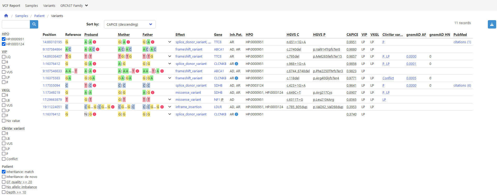

# Variant Interpretation Pipeline
VIP is a flexible human variant interpretation pipeline for rare disease using state-of-the-art pathogenicity prediction ([CAPICE](https://github.com/molgenis/capice)) and template-based interactive reporting to facilitate decision support.



## Documentation
VIP documentation is available at this link https://molgenis.github.io/vip/.

## Quick Reference

### Requirements
- x86_64 architecture
- Java
- [Apptainer](https://apptainer.org/docs/admin/main/installation.html#install-from-pre-built-packages)
- 400GB free disk space

### Installation
```bash
git clone https://github.com/molgenis/vip
bash vip/install.sh
```

### Usage
```bash
usage: vip -w <arg> -i <arg> -o <arg>
  -w, --workflow <arg>  workflow to execute. allowed values: cram, fastq, vcf
  -i, --input    <arg>  path to sample sheet .tsv
  -o, --output   <arg>  output folder
  -c, --config   <arg>  path to additional nextflow .cfg (optional)
  -p, --profile  <arg>  nextflow configuration profile (optional)
  -r, --resume          resume execution using cached results (default: false)
  -h, --help            print this message and exit
```

## Developers
#### To create the documentation pages:
```
pip install mkdocs mkdocs-mermaid2-plugin
mkdocs serve
```

#### To publish the documentation pages:
```
mkdocs gh-pages
```

#### To locally develop VIP on MacOS/Windows:
First install [Multipass](https://multipass.run/). After which, run the following:
```bash
1. `git clone https://github.com/molgenis/vip`
2. `multipass launch jammy --name vip --cpus 4 --disk 12G --memory 12G --cloud-init ./vip/multipass.yaml --mount ./vip:~/vip`
3. `multipass shell vip`
```
Above values for `--cpus`/`--memory`/`--disk` can be adjusted based on exact needs (or can be adjusted later using `multipass set` while the VM is not running).
It is advised to have enough spare `--disk` space, as even though data is written to the mounted directory, temporary space is needed when for example building new images.
While it might be possible to run VIP as a whole through this image, this is untested and unsupported.